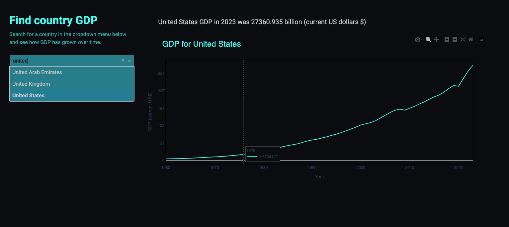

# get-gdp-dashboard

A simple Flask Dash app that allows users to search for a country and visualize its GDP growth. The app uses data from the World Bank API. The app includes a github actions workflow that does unit and integration testing, lintin, deploys the app to Cloud Run using docker. 

[Available at](https://gdp-dash-812336563676.europe-north1.run.app/)

- A searchable dropdown to select a country.
- A graph showing the historical GDP growth of the selected country.
- Text showing the latest available GDP data for the selected country.

## Technologies Used

- **Flask**: Backend framework for serving the Dash app.
- **Dash**: Plotly-based framework for interactive web apps.
- **World Bank API**: Data source for fetching GDP history.
- **Poetry**: Python dependency management.
- **GitHub Actions**: CI/CD pipeline for automatic deployment.
- **Google Cloud Run**: Serverless platform for running the app.

### Run app locally: 
$ python3 -m venv .venv
$ source .venv/bin/activate 
$ poetry install 
$ python app.py

